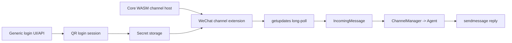

# WeChat Integration Design

**Date:** 2026-03-25
**Status:** Ready for implementation
**Goal:** Add WeChat support to IronClaw using the same upstream iLink Bot protocol as `@tencent-weixin/openclaw-weixin`, while keeping the implementation aligned with IronClaw's extension-first channel architecture.

---

## Upstream Baseline

The current upstream npm package is `@tencent-weixin/openclaw-weixin` version `2.0.1`.

From the package README and source, the upstream WeChat channel does all of the following:

- logs in by QR code against `https://ilinkai.weixin.qq.com`
- receives inbound messages by long-polling `ilink/bot/getupdates`
- sends outbound messages through `ilink/bot/sendmessage`
- uses `ilink/bot/getconfig` and `ilink/bot/sendtyping` for typing indicators
- uses `ilink/bot/getuploadurl` for media uploads
- persists `get_updates_buf` for long-poll resume
- persists `context_token` so replies stay attached to the right WeChat session
- supports multiple logged-in WeChat bot accounts
- treats WeChat as a direct-message-only channel
- block-sends replies instead of token streaming

This design treats that upstream behavior as the capability boundary. We should not add scope based on features the upstream plugin does not have.

---

## Implementation Direction

IronClaw should **not** try to load the upstream OpenClaw plugin directly.

Instead, IronClaw should implement a **native channel extension** under `channels-src/wechat/` and only extend the host/runtime where that support is generic and reusable.

### Why not host the npm plugin directly

- The upstream package depends on `openclaw/plugin-sdk/*` APIs and runtime contracts that IronClaw does not have.
- It assumes OpenClaw-specific lifecycle concepts such as `gateway.startAccount`.
- Recreating an OpenClaw-compatible Node plugin host inside IronClaw would be more work and more fragile than implementing the protocol directly.

### Why `channels-src/wechat/`

- It matches the existing layering used by other platform channels.
- It keeps platform protocol logic out of host-owned core modules.
- It leaves room for the channel to move outside this repo later without changing the host model.

Recommended layout:

```text
channels-src/
  wechat/
    Cargo.toml
    build.sh
    wechat.capabilities.json
    src/
      lib.rs
      api.rs
      auth.rs
      state.rs
      types.rs
```

---

## Phase 1 Scope

Phase 1 is a **single-account** implementation of the upstream WeChat channel.

The point of this phase is to keep the channel aligned with upstream behavior while removing the one biggest source of host/runtime complexity: multi-account lifecycle.

### Must-have in Phase 1

- QR code login
- one connected WeChat bot account
- direct-message text receive/send
- `getupdates` long-poll loop
- `sendmessage` outbound replies
- typing indicators via `getconfig` and `sendtyping`
- inbound image download/decrypt for vision
- outbound image upload/send via `getuploadurl`
- `context_token` persistence
- `get_updates_buf` persistence
- login persistence across restart
- extension-first packaging under `channels-src/wechat/`

### Explicit simplification from upstream

- multi-account support is deferred

### Follow-up after Phase 1

These are upstream features, so they belong on the roadmap, but they do not need to block the first implementation cut:

- broader media parity beyond images (files/video/voice)

We should not spend time listing non-goals that come from outside the upstream capability boundary.

---

## Proposed Architecture



### Extension responsibilities

`channels-src/wechat/` should own:

- iLink API request/response types
- QR login protocol calls
- long-polling `getupdates`
- `context_token` storage and lookup
- outbound `sendmessage`
- WeChat-specific status/error mapping

### Host responsibilities

IronClaw core should only own reusable pieces:

- installing and activating the WASM channel
- generic secret persistence
- generic QR/device-login session handling for channels
- exposing login flow through authenticated UI/API
- starting and polling the channel runtime

---

## Data And State Model

Phase 1 is single-account, so state should stay simple.

### Secrets

- `wechat_bot_token`

This is written after QR login succeeds and reused on restart.

### Channel state

Under the channel workspace prefix, persist:

- `state/get_updates_buf.json`
- `state/context_tokens.json`

`context_tokens.json` maps the WeChat peer to its latest `context_token`.

### Inbound message mapping

For each inbound WeChat DM:

- `channel = "wechat"`
- `user_id = <wechat sender id>` or owner scope if it is the bound owner
- `thread_id = Some("wechat:<sender_id>")`
- `conversation_scope_id = Some("wechat:<sender_id>")`

`metadata_json` should include:

- `from_user_id`
- `to_user_id`
- `message_id`
- `context_token`

That is enough for `on_respond()` to send the reply back to the right peer.

---

## Minimal Host Uplift

The current extension host is close, but Phase 1 still needs one important addition: a generic interactive login flow for channels.

Minimum host support needed:

1. Start a channel login session.
2. Return QR payload plus a session identifier.
3. Poll login session status.
4. On success, write the returned token to channel secrets.
5. Reload or reactivate the channel so polling starts automatically.

This should be added as a generic channel-auth capability, not as WeChat-specific core logic.

---

## User Flow

Phase 1 should be **web-first**, because the target user is a normal WeChat user rather than a CLI-only operator.

1. Install or enable the `wechat` channel extension.
2. Click "Connect WeChat".
3. Web UI requests a login session from the host.
4. Web UI displays the QR code.
5. User scans and confirms on their phone.
6. Host stores `wechat_bot_token`.
7. Channel reloads and starts polling.
8. User sends a DM in WeChat and receives IronClaw replies there.

CLI support can still exist for development, but it should not be the primary Phase 1 UX.

---

## Message Handling Semantics

### Inbound

On each poll:

1. load `get_updates_buf`
2. call `getupdates`
3. persist the new cursor if present
4. normalize inbound text messages into `IncomingMessage`
5. persist the latest `context_token` for that peer
6. emit the message to the agent

### Outbound

On response:

1. read peer routing info from `metadata_json`
2. load the latest `context_token`
3. convert the response to plain text if needed
4. send one coalesced text reply via `sendmessage`

This matches the upstream channel's block-send behavior.

---

## Testing Plan

### Unit tests

- QR login response parsing
- `get_updates_buf` round-trip
- `context_token` round-trip
- inbound message normalization
- outbound metadata routing

### Integration tests

Use a mock iLink server to cover:

- QR login success and expiry
- restart without re-login
- inbound poll -> agent -> outbound text reply
- cursor resume after restart

---

## Phase 2

After Phase 1 is stable, add the upstream features we intentionally deferred:

- multi-account support
- media upload/send
